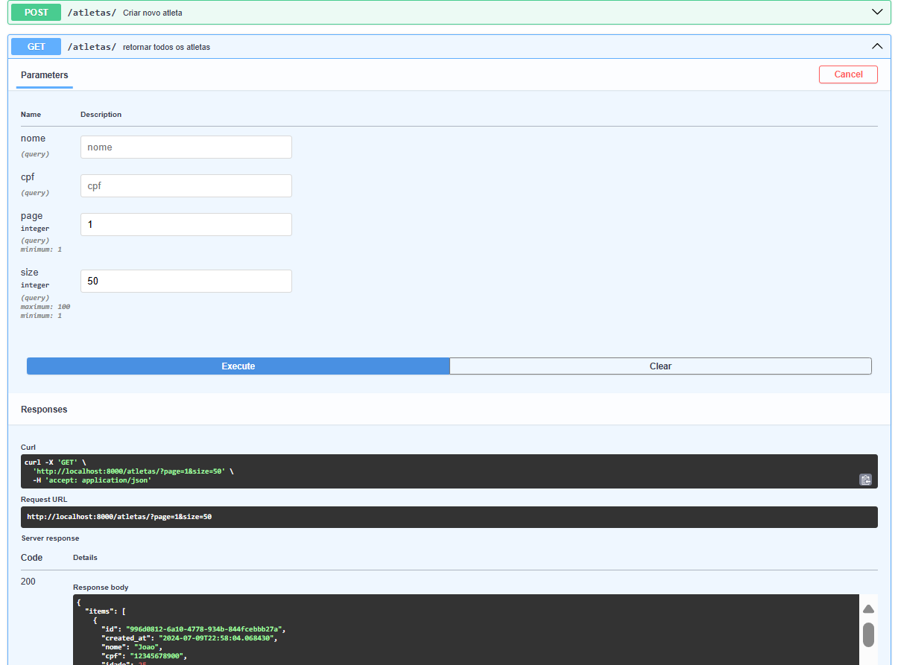

# 🏋️ Workout

**Workout** é uma API para gerenciar atletas em centros de treinamento, categorizados por seus grupos de treinamento. Construída com **FastAPI** e **SQLAlchemy**, e utilizando **PostgreSQL** para uma gestão de dados robusta.

## 🚀 Funcionalidades

- **FastAPI** para APIs web modernas e rápidas
- **SQLAlchemy** para ORM e interações com banco de dados
- **PostgreSQL** para armazenamento de dados confiável e eficiente
- Categorizar atletas por grupos de treinamento
- Gerenciar perfis de atletas e cronogramas de treinamento



## Instalação

1. Clone o Repositório

```bash
git clone https://github.com/gilzamir18/workoutapi.git
cd workout
```

2. Instale o Postgres via docker:

```bash
docker-compose -up -d
```


3. Instale as dependências

```bash
python -m venv venv
source venv/bin/activate  # No Windows, use `venv\Scripts\activate`
```

4. Configure o banco de dados:

```bash
alembic init alembic
```

5. Execute a aplicação:

```bash
uvicorn workout_api.main:app --reload
```

6. Crie a migração dos dados:

```bash
alembic revision --autogenerate -m $(d)
```

7. Faça a migração dos dados:
```bash
alembic upgrade head
```

📖 Uso
Uma vez que o servidor estiver rodando, você pode acessar a documentação interativa da API em:

Swagger UI: http://localhost:<port>/docs

* <port> geralmente é 8000.

# Exemplos de rotas:
POST /categoria: Cadastra uma nova categoria de atleta.
POST /centro_treinamento: Cadastra um novo centro de treinamento.
GET /atletas: Recupera todos os atletas.
POST /atletas: Cria um novo atleta.
GET /atletas/{id}: Recupera um atleta pelo ID.
PUT /atletas/{id}: Atualiza as informações de um atleta.
DELETE /atletas/{id}: Deleta um atleta.
